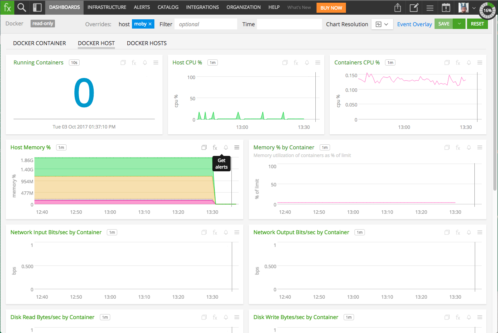
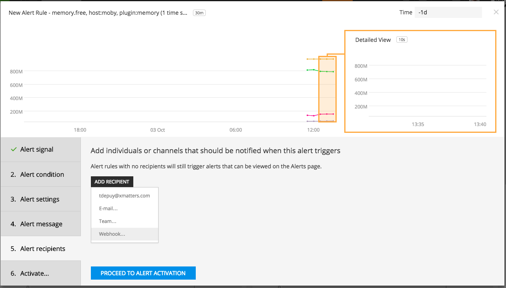
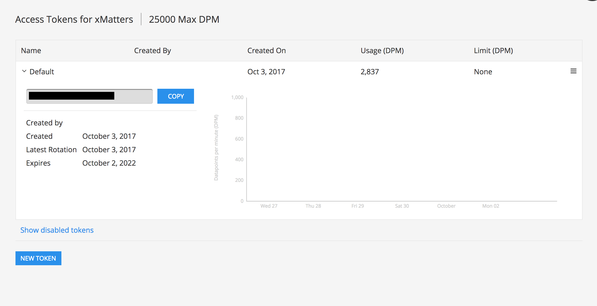
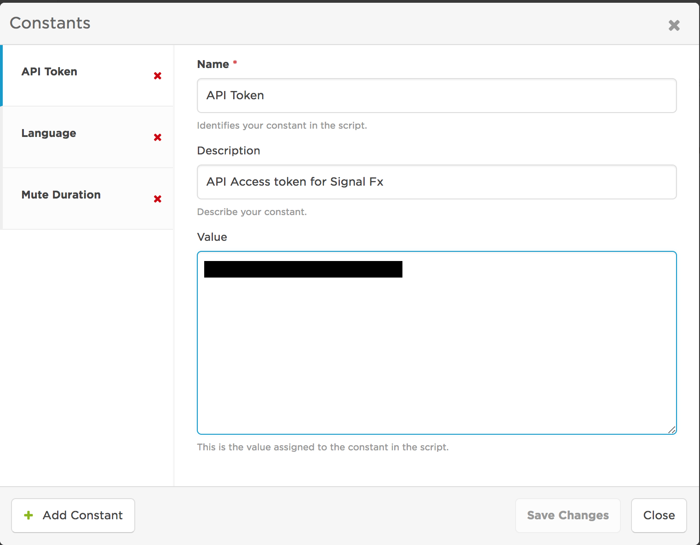
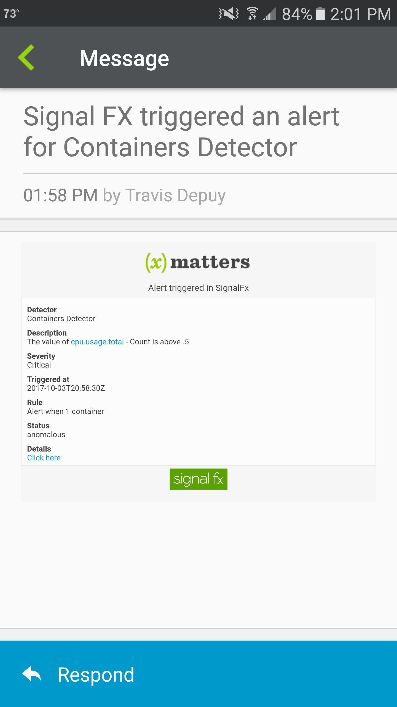

# SignalFx
SignalFx is an Enterprise Cloud Monitoring solution with intelligent analytics. This integration extends the alerting capabilities to include the xMatters integration and notification platform. 

<kbd>
  
</kbd>

# Pre-Requisites
* [SignalFx account](https://signalfx.com/)
* xMatters account - If you don't have one, [get one](https://www.xmatters.com)!

# Files
* [SignalFx.zip](SignalFx.zip) - Comm plan with the form and integration scripts

# How it works
An alert fires a webhook to the xMatters integration builder which parses the incoming JSON and terminates any existing events matching the `incident_id` and finally, builds the payload and creates the event targeting the default recipients. Alternatively [subscriptions](http://help.xmatters.com/OnDemand/userguide/receivingalerts/subscriptions/howtousesubscriptions.htm) can be set up to notify the desired parties. From the alert, you can mute, unmute or resolve the alert in SignalFx. 

The integration currently does not notify on resolved, but the integration can easily be extended to allow for this.

# Installation


## xMatters set up
1. Login to xMatters and import the [SignalFx.zip Comm Plan](SignalFx.zip). For details on importing communication plans go [here](http://help.xmatters.com/OnDemand/xmodwelcome/communicationplanbuilder/exportcommplan.htm)
2. Navigate to the Integration Builder and expand the inbound integrations and click on the `Alert - Inbound` script. Scroll to the bottom and copy the url. Save for later. 
3. Navigate to the `SignalFx Alerts` form and edit the layout. 
4. Enter the recipients, or, alternatively [subscriptions](http://help.xmatters.com/OnDemand/userguide/receivingalerts/subscriptions/howtousesubscriptions.htm) can be set up to notify the desired parties.


## SignalFx set up
### Outbound from SignalFx
1. Login to SignalFx and navigate to a Dashboard that needs alerting. 
2. Hover over the alert icon on a chart to add alerts to.

<kbd>
	
</kbd>

3. If there is not an existing Detector, click the New Detector from Chart and create a new Alert Rule. 
4. Populate the Alert signal, Alert condition, settings and message as desired. 
5. On the Alert recipients section, click Add Recipient and select `Webhook...`

<kbd>
	
</kbd>

6. Click Custom and in the Webhook Notification dialog, paste the URL copied from the inbound integration [above](#xmatters-set-up).
7. Click Update and then Activate the Alert. 

### Inbound to SignalFx

1. Login to SignalFx and click the Profile in the upper right corner and click `My profile`.
2. In the Organizations section at the bottom, click `Access Tokens`. 
3. Expand Default and click `Show Token` and copy the token value. 

<kbd>
  
</kbd>

4. Login to xMatters and navigate to the Developer tab > SignalFx comm plan and click Integration Builder. 
5. Click on `Edit Constants` and select the `API Token` constant. Paste the token from above into this value. 

<kbd>
  
</kbd>


# Testing
Update an Alert condition or otherwise trigger something that will trip the Alert. This will fire the alert and invoke the inbound integration builder script. This script will parse the incoming payload and create an event.

<kbd>
	
</kbd>

# Troubleshooting
If xMatters is not sending notifications when it should be, try adding an email recipient in the Alert Recipients section and trigger the alert again. If the email is received but still nothing in xMatters, then check the Activity Stream for the `Alert - Inbound` integration script for any errors. If there are no errors, but an event is created, there will be something like this at the end
```
Creating new event for Signal Fx incident DLOjpF7AYmI
> POST https://acme.xmatters.com/reapi/2015-04-01/forms/UUID/triggers HTTP/1.1
> Accept: text/plain, application/json, application/*+json, */*
> User-Agent: Xerus (EndpointClient)
> X-Trace: More UUIDs
> Content-Type: application/json; charset=UTF-8
> Content-Length: 770
{"properties":{"severity":"Critical","detectOnCondition":"when(A > limit_above_27)","inputs":"{\"A\":{\"value\":\"1\",\"fragment\":\"data('cpu.usage.total', extrapolation='null', maxExtrapolations=-1).count().publish(label='A', enable=False)\"},\"limit_above_27\":{\"value\":\"0.5\",\"fragment\":\"const(.5)\"}}","rule":"Alert when 1 container","description":"The value of cpu.usage.total - Count is above .5.","sf_schema":2,"eventType":"DLO5a_ZAgAA__Alert when 1 container","incidentId":"DLOjpF7AYmI","detector":"Containers Detector","detectorUrl":"URLHERE/edit?incidentId=DLOjpF7AYmI&is=anomalous","status":"anomalous","timestamp":"2017-10-03T20:58:30Z"},"recipients":[],"integrationUUID":"UUID"}

< HTTP/1.1 200 OK
< Date: Tue, 03 Oct 2017 20:58:47 GMT
< Cache-Control: no-cache,no-store,max-age=0
< Expires: Thu, 01 Jan 1970 00:00:00 GMT
< Content-Type: application/json
< X-Rate-Limit-Limit: 60
< X-Rate-Limit-Org-Name: Mandalore
< X-Rate-Limit-Resource: FormEventPost
< Via: 1.1 xmatters
< Vary: Accept-Encoding
< Transfer-Encoding: chunked
< X-Robots-Tag: noindex
< X-FRAME-OPTIONS: SAMEORIGIN
< Strict-Transport-Security: max-age=7776000; includeSubDomains; preload;
{"id":"5118655"}
```

Of special interest is the `200 OK` and the id value at the end. 

If the event is created, check the Reports tab for the active event and review the logs for notification errors. 


